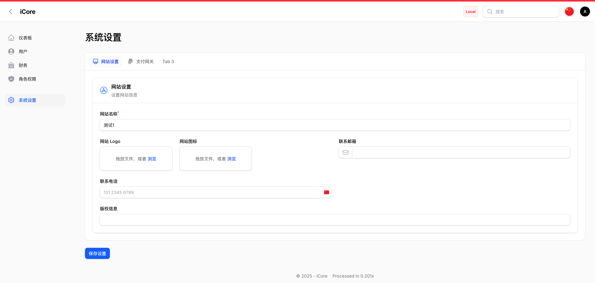

# 🚀 Filament 脚手架

一个功能强大的 Filament 脚手架，旨在加速管理后台开发。

内置权限管理，用户管理，财务钱包管理和系统设置，并且带有前台 API 和自动生成 API 文档。

基于 Laravel 12 和 Filament 4，本脚手架参考了官方插件列表内的同类项目，针对中文项目优化。

参考项目列表：

https://gitee.com/xujinhui/filament

https://filamentphp.com/plugins/siubie-kaido-kit

https://filamentphp.com/plugins/riodewanto-superduper-starter

目前版本： v1.0.0


## 📦 常用命令行

### 更新缓存 一般用户创建资源后在后台看不到或者修改代码以后不生效
```bash
php artisan cache:clear
php artisan clear-compiled
composer dump-autoload
php artisan optimize
php artisan view:clear
php artisan filament:optimize
php artisan icons:cache
```

### 新建订单模型 Order
```bash
// 创建模型和数据库迁移
php artisan make:model Order -m
// 创建 API 控制器
php artisan make:controller Api/OrderController --model=App\\Models\\Order
// 创建请求文件
php artisan make:request Api/OrderRequest
// 创建资源文件
php artisan make:resource OrderResource
// 创建策略文件
php artisan make:policy OrderPolicy
或者推荐使用这个
php artisan shield:generate --all --ignore-existing-policies
// 创建任务文件
php artisan make:job OrderPaid
// 创建 Filament 后台资源文件
php artisan make:filament-resource Order --generate
```

### 创建关联管理
```bash
php artisan make:filament-relation-manager UserResource userWalletLog
```

### 创建枚举
```bash
php artisan make:enum PayType
```
## ✨ 特色

### 🛠️ 开发者体验

- ⚡ 使用定制化 [Filament](https://filamentphp.com/) 快速生成 CRUD
- 定制了 stubs/model.stub 和 stubs/filament/Resource.stub 和 stubs/filament/ResourcePage.stub 和 stubs/filament/ResourceEditPage.stub
- 📚 使用 [Scramble](https://scramble.dedoc.co/) 轻松生成 API 文档  访问路径 /docs/api

### 🔐 认证与授权

- 🛡️ 基于角色的访问控制（RBAC）使用 [Filament Shield](https://filamentphp.com/plugins/bezhansalleh-shield)
- 👤 使用 [Filament Breezy](https://filamentphp.com/plugins/jeffgreco-breezy) 管理用户资料
- 🔒 集成双因素认证功能
- 👥 简化的用户角色分配机制
- 🎭 通过 [Filament Impersonate](https://filamentphp.com/plugins/joseph-szobody-impersonate) 实现用户模拟

### 📡 集成

- 📨 使用 [Resend](https://resend.com/) 的邮件集成
- 📦 集成 [yansongda/pay](https://github.com/yansongda/laravel-pay) 提供了支付宝支付和微信支付参考样例

### ⚙️ 配置与设置

- 🎛️ 通过 [Settings](https://filamentphp.com/plugins/outerweb-settings) 实现动态设置管理

## 🚀 快速开始

1. 克隆代码

    ```bash
    git clone git@github.com:imnpc/iCore.git
    ```

2. 使用 Composer 安装依赖

    ```bash
    cd ~/Code/iCore
    composer install
    composer update
    ```

3. 使用 Npm 安装依赖

    ```bash
    npm install
    ```

4. 复制 .env

    ```bash
    cp .env.example .env
    ```

5. 修改数据库配置在 .env 文件中

    ```bash
    DB_CONNECTION=mysql
    DB_HOST=127.0.0.1
    DB_PORT=3306
    DB_DATABASE=demo
    DB_USERNAME=root
    DB_PASSWORD=
    ```

6. 配置 Resend 邮件 (可选)

    ```bash
    #resend
    MAIL_MAILER=resend
    MAIL_HOST=127.0.0.1
    MAIL_PORT=2525
    MAIL_USERNAME=null
    MAIL_PASSWORD=null
    MAIL_ENCRYPTION=null
    RESEND_API_KEY=
    MAIL_FROM_ADDRESS="admin@domain.com"
    MAIL_FROM_NAME="${APP_NAME}"
    ```

7. 生成 App Key

    ```bash
    php artisan key:generate
    ```

8. 迁移数据库

    ```bash
    php artisan migrate
    ```
9. 创建软连接

     ```bash
     php artisan storage:link
     ```

10. 生成超级管理员账号(如果导入 sql 目录下的数据库请忽略步骤：10 11 12)

     ```bash
     php artisan make:filament-user
     ```

11. 配置权限(不覆盖已有策略文件)

     ```bash
     php artisan shield:generate --all --ignore-existing-policies --panel=admin
     php artisan filament:optimize
     ```

12. 设置为超级管理员

     ```bash
    php artisan shield:super-admin --user=1
     ```

13. 运行程序，请执行以下命令 或者  composer run dev

     ```bash
    npm run build
     ```

14. 访问 /admin 登录后台.


## 使用 Laravel Sail 在 Docker 中运行

1. 克隆代码

    ```bash
    git clone git@github.com:imnpc/iCore.git
    ```

2. 复制 .env

    ```bash
    cp .env.example .env
    ```

3. 使用 Composer 安装依赖

    ```bash
    composer install
    composer update
    ```

4. 安装 Laravel Sail

    ```bash
    composer require laravel/sail --dev
    php artisan sail:install
    ```

5. 运行 Sail

    ```bash
    ./vendor/bin/sail up -d
    ```

6. 生成 App Key

    ```bash
    ./vendor/bin/sail artisan key:generate
    ```

7. 迁移数据库

    ```bash
    ./vendor/bin/sail artisan migrate
    ```

8. 配置权限(不覆盖已有策略文件)

    ```bash
    ./vendor/bin/sail artisan shield:generate --all --ignore-existing-policies
    ```

9. 生成超级管理员账号

     ```bash
     ./vendor/bin/sail artisan make:filament-user
     ```

9. 设置为超级管理员

    ```bash
    ./vendor/bin/sail artisan shield:super-admin --user=1
    ```

10. 运行程序，请执行以下命令 或者  composer run dev

    ```bash
    ./vendor/bin/sail npm run build
    ```
11. 访问 /admin 登录后台.

### 使用的插件列表

#### Filament 插件
- 权限管理 (bezhansalleh/filament-shield)
- 后台个人资料和双因素验证 (jeffgreco13/filament-breezy)
- Excel 导出 (pxlrbt/filament-excel)
- 模拟用户登录 (techstudio/filament-impersonate)
- 电话号码输入 (ysfkaya/filament-phone-input)
- 软件版本号 (awcodes/filament-versions)
- 语言切换 (bezhansalleh/filament-language-switch)
- 模型翻译 (maggomann/filament-model-translator)
- 系统设置 (outerweb/filament-settings)
- 编辑信息锁定 (discoverydesign/filament-gaze)
- 钱包管理界面 (/filament-wallet)
- 底部版权设定 (devonab/filament-easy-footer)
- 信息资源打标签 (filament/spatie-laravel-tags-plugin)
- 主题切换 (hasnayeen/themes)
- 标识当前运行环境 (saasykit/filament-oops)
- 封禁用户 (widiu7omo/filament-bandel)
- 行为日志记录 (rmsramos/activitylog)

#### 支付与财务
- 微信 SDK (overtrue/laravel-wechat)
- 支付宝/微信支付集成 (yansongda/laravel-pay)
- 虚拟钱包系统 (bavix/laravel-wallet)

#### 开发工具
- API 文档生成 (dedoc/scramble)
- 路由属性注解 (spatie/laravel-route-attributes)
- 高级查询构建器 (spatie/laravel-query-builder)

#### 其他功能
- 短信通知集成 (leonis/easysms-notification-channel)
- 多语言枚举 (jiannei/laravel-enum)
- 国家地区旗帜 (stijnvanouplines/blade-country-flags)
- 响应格式化 (jiannei/laravel-response)
- 邮件服务 (resend/resend-laravel)

###  📷 截图


